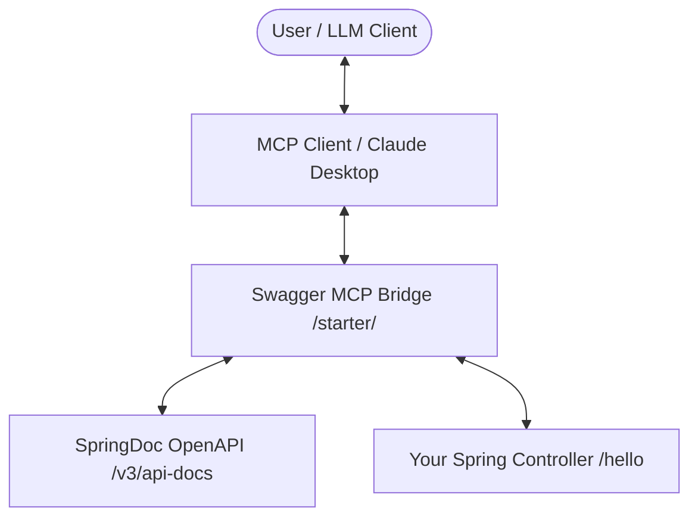

# spring-boot-starter-swagger-mcp

[](https://github.com/Neo1228/spring-boot-starter-swagger-mcp/actions/workflows/ci.yml)
[](https://opensource.org/licenses/Apache-2.0)
[](https://www.oracle.com/java/technologies/javase/jdk17-archive-downloads.html)
[](https://spring.io/projects/spring-boot)

Spring Boot starter that automatically exposes SpringDoc OpenAPI operations as MCP tools.

## What You Get

- Auto-discovery of OpenAPI operations from your running Spring app
- Auto-registration of MCP tools for discovered API operations
- Smart-context tools: `meta_discover_api_tools`, `meta_invoke_api_by_intent`
- Response optimization with projection/summarization controls
- Risk controls for dangerous operations (`_confirm`, blocked paths, role checks, audit logs)

## Architecture



## Quick Start (New Empty Spring Boot Project)

### 1. Create a Spring Boot app

Use:

- Java 17+
- Spring Boot 3.5.x
- Spring Web

### 2. Add dependencies

Gradle (`build.gradle.kts`):

```kotlin
plugins {
    id("org.springframework.boot") version "3.5.9"
    id("io.spring.dependency-management") version "1.1.7"
    java
}

java {
    sourceCompatibility = JavaVersion.VERSION_17
}

repositories {
    mavenCentral()
}

dependencies {
    implementation("org.springframework.boot:spring-boot-starter-web")
    implementation("org.springdoc:springdoc-openapi-starter-webmvc-api:2.8.3")
    implementation("io.github.neo1228:spring-boot-starter-swagger-mcp:<version>")
}
```

Maven (`pom.xml`):

```xml
<properties>
  <swagger-mcp.version>0.1.0-SNAPSHOT</swagger-mcp.version>
</properties>

<dependencies>
  <dependency>
    <groupId>org.springframework.boot</groupId>
    <artifactId>spring-boot-starter-web</artifactId>
  </dependency>
  <dependency>
    <groupId>org.springdoc</groupId>
    <artifactId>springdoc-openapi-starter-webmvc-api</artifactId>
    <version>2.8.3</version>
  </dependency>
  <dependency>
    <groupId>io.github.neo1228</groupId>
    <artifactId>spring-boot-starter-swagger-mcp</artifactId>
    <version>${swagger-mcp.version}</version>
  </dependency>
</dependencies>
```

Use a release version (for example `0.1.0`) when consuming from a remote artifact repository.

### 3. Add one controller

```java
import io.swagger.v3.oas.annotations.Operation;
import org.springframework.web.bind.annotation.GetMapping;
import org.springframework.web.bind.annotation.RequestParam;
import org.springframework.web.bind.annotation.RestController;

import java.util.Map;

@RestController
public class HelloController {

    @Operation(operationId = "getHello", summary = "Get greeting message")
    @GetMapping("/hello")
    public Map<String, Object> hello(@RequestParam(defaultValue = "world") String name) {
        return Map.of("message", "Hello " + name);
    }
}
```

### 4. Add configuration (`application.yml`)

```yaml
spring:
  ai:
    mcp:
      server:
        protocol: STREAMABLE_HTTP
        streamable-http:
          mcp-endpoint: /mcp

swagger:
  mcp:
    enabled: true
    api-docs-path: /v3/api-docs
    tool-name-prefix: api_
```

### 5. Run and verify

1. Start app: `./gradlew bootRun` or `./mvnw spring-boot:run`
2. Verify OpenAPI: `http://localhost:8080/v3/api-docs`
3. Verify MCP endpoint: `http://localhost:8080/mcp`
4. Connect from an MCP client

Generated tool names follow `<tool-name-prefix><operation-id>` (example: `api_gethello`).

## Use It Before Public Release (Local Development Install)

If the artifact is not published to a remote registry yet:

1. Build and publish to local Maven cache:
   - `./gradlew publishToMavenLocal`
2. In your consumer app:
   - add `mavenLocal()` repository
   - use version `0.1.0-SNAPSHOT` (or your chosen local version)

## Key Configuration

- `swagger.mcp.enabled`: enable/disable bridge (default `true`)
- `swagger.mcp.api-docs-path`: OpenAPI docs path (default `/v3/api-docs`)
- `swagger.mcp.tool-name-prefix`: tool name prefix (default `api_`)
- `swagger.mcp.smart-context.gateway-only`: expose only meta tools
- `swagger.mcp.security.require-confirmation-for-risky-operations`: require `_confirm` token for risky methods

For risky HTTP methods (`POST`, `PUT`, `PATCH`, `DELETE`), default policy requires `_confirm=CONFIRM`.

## Compatibility Matrix

| Starter | Java | Spring Boot | springdoc-openapi | Spring AI BOM |
|---|---|---|---|---|
| 0.1.x | 17+ | 3.5.x | 2.8.3 | 1.1.2 |

Spring Boot 4.x is not supported in this repository.

## Example Consumer Project

See `examples/minimal-webmvc-gradle` for a minimal app using this starter.

## Release And Versioning

- Release process: `RELEASING.md`
- Versioning policy: `VERSIONING.md`
- Changelog: `CHANGELOG.md`

## Development

- Run tests: `./gradlew test`
- Contribution guide: `CONTRIBUTING.md`
- Security reporting: `SECURITY.md`

## License

Apache License 2.0 (`LICENSE`)
