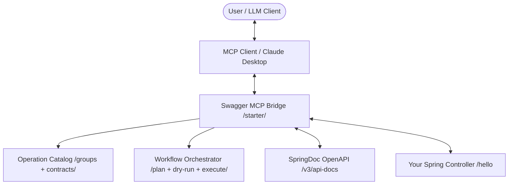

# Swagger MCP Bridge

[](https://github.com/Neo1228/spring-boot-starter-swagger-mcp/actions/workflows/ci.yml)
[](https://opensource.org/licenses/Apache-2.0)
[](https://www.oracle.com/java/technologies/javase/jdk17-archive-downloads.html)
[](https://spring.io/projects/spring-boot)
[](https://github.com/punkpeye/awesome-mcp-servers/pull/2059)

**Turn any SpringDoc-powered Spring Boot API into a production-ready MCP gateway.**

Swagger MCP Bridge discovers your OpenAPI operations, publishes them as safe MCP tools, and adds a smart gateway layer for API discovery, validation, response shaping, and multi-step workflow orchestration.

## Why Swagger MCP Bridge

Most MCP API bridges stop at a thin tool wrapper. Swagger MCP Bridge is designed as a runtime gateway: it exposes your existing Spring controllers to LLM clients while preserving contracts, guardrails, and operational visibility.

## What You Get

- Zero-boilerplate discovery of SpringDoc OpenAPI operations from your running Spring app
- Automatic MCP tool registration for discovered API operations
- Smart-context gateway tools: `meta_get_api_capabilities`, `meta_validate_api_call`, `meta_discover_api_tools`, `meta_describe_api_tool`, `meta_list_api_groups`, `meta_plan_api_workflow`, `meta_invoke_api_workflow`, `meta_invoke_api_by_intent`
- API catalog and workflow layer for capability inspection, preflight validation, grouped exploration, dry-run planning, and sequential execution
- Rich MCP input schemas generated from OpenAPI constraints: required fields, enums, numeric/string/object limits, examples, and deprecation hints
- Response shaping with JSONPath projection and summarization controls
- Execution guardrails: required argument validation, unresolved path-template protection, and safe `_headers` filtering
- Structured MCP error responses with stable codes such as `INVALID_ARGUMENT`, `SECURITY_DENIED`, `WORKFLOW_ERROR`, and `HTTP_DISPATCH_FAILED`
- Java 17 bytecode with CI coverage on Java 17, 21, and 25
- Optional virtual-thread HTTP dispatch on Java 21+ runtimes, with automatic platform-thread fallback on Java 17
- Production guardrails for dangerous operations: `_confirm`, blocked paths, role checks, audit logs, and structured client errors

## Architecture


```mermaid
graph TD
    User([User / LLM Client]) <--> MCP[MCP Client / Claude Desktop]
    MCP <--> Bridge[Swagger MCP Bridge /starter/]
    Bridge --> Catalog[Operation Catalog /groups + contracts/]
    Bridge --> Workflow[Workflow Orchestrator /plan + dry-run + execute/]
    Bridge <--> Docs[SpringDoc OpenAPI /v3/api-docs]
    Bridge <--> API[Your Spring Controller /hello]
```

## Quick Start

### 1. Create a Spring Boot app

Use:

- Java 17+
- Spring Boot 3.5.x
- Spring Web

### 2. Add dependencies

Gradle (`build.gradle.kts`):

```kotlin
plugins {
    id("org.springframework.boot") version "3.5.14"
    id("io.spring.dependency-management") version "1.1.7"
    java
}

java {
    sourceCompatibility = JavaVersion.VERSION_17
}

repositories {
    mavenCentral()
}

dependencies {
    implementation("org.springframework.boot:spring-boot-starter-web")
    implementation("org.springdoc:springdoc-openapi-starter-webmvc-api:2.8.17")
    implementation("io.github.neo1228:openapi-mcp-spring-boot-starter:<version>")
}
```

The Maven artifact intentionally uses the neutral OpenAPI name rather than Swagger branding:

```text
io.github.neo1228:openapi-mcp-spring-boot-starter
```

Maven (`pom.xml`):

```xml
<properties>
  <openapi-mcp.version>0.1.0-SNAPSHOT</openapi-mcp.version>
</properties>

<dependencies>
  <dependency>
    <groupId>org.springframework.boot</groupId>
    <artifactId>spring-boot-starter-web</artifactId>
  </dependency>
  <dependency>
    <groupId>org.springdoc</groupId>
    <artifactId>springdoc-openapi-starter-webmvc-api</artifactId>
    <version>2.8.17</version>
  </dependency>
  <dependency>
    <groupId>io.github.neo1228</groupId>
    <artifactId>openapi-mcp-spring-boot-starter</artifactId>
    <version>${openapi-mcp.version}</version>
  </dependency>
</dependencies>
```

Use a release version (for example `0.1.0`) when consuming from a remote artifact repository.

### 3. Add one controller

```java
import io.swagger.v3.oas.annotations.Operation;
import org.springframework.web.bind.annotation.GetMapping;
import org.springframework.web.bind.annotation.RequestParam;
import org.springframework.web.bind.annotation.RestController;

import java.util.Map;

@RestController
public class HelloController {

    @Operation(operationId = "getHello", summary = "Get greeting message")
    @GetMapping("/hello")
    public Map<String, Object> hello(@RequestParam(defaultValue = "world") String name) {
        return Map.of("message", "Hello " + name);
    }
}
```

### 4. Add configuration (`application.yml`)

```yaml
spring:
  ai:
    mcp:
      server:
        protocol: STREAMABLE_HTTP
        streamable-http:
          mcp-endpoint: /mcp

swagger:
  mcp:
    enabled: true
    api-docs-path: /v3/api-docs
    tool-name-prefix: api_
```

### 5. Run and verify

1. Start app: `./gradlew bootRun` or `./mvnw spring-boot:run`
2. Verify OpenAPI: `http://localhost:8080/v3/api-docs`
3. Verify MCP endpoint: `http://localhost:8080/mcp`
4. Connect from an MCP client

Generated tool names follow `<tool-name-prefix><operation-id>` (example: `api_gethello`).


## MCP Client Workflow

This starter exposes direct API tools and a meta-tool layer so general MCP clients can work with large APIs without guessing tool names upfront:

1. `meta_get_api_capabilities` returns API catalog stats, available gateway tools, orchestration features, safety policy, and response controls.
2. `meta_list_api_groups` summarizes the exposed API catalog by OpenAPI tag/group.
3. `meta_discover_api_tools` finds relevant operations for a natural-language request.
4. `meta_describe_api_tool` returns the selected tool's method/path, parameters, required arguments, request body schema, risk flags, and full MCP input schema.
5. `meta_validate_api_call` validates one generated API tool call without dispatching HTTP, including required arguments, risky-operation confirmation, and dispatch preview.
6. `meta_plan_api_workflow` turns a workflow goal into a deterministic candidate step plan with contracts and risk flags.
7. `meta_invoke_api_workflow` dry-runs or executes multiple generated API tools sequentially.
8. `meta_invoke_api_by_intent` can select and invoke the best matching operation when the client already has enough arguments.

The configured `tool-name-prefix` is still applied, so the default generated names are `api_meta_get_api_capabilities`, `api_meta_validate_api_call`, `api_meta_list_api_groups`, `api_meta_discover_api_tools`, `api_meta_describe_api_tool`, `api_meta_plan_api_workflow`, `api_meta_invoke_api_workflow`, and `api_meta_invoke_api_by_intent`.

When a tool call is rejected, the text content remains human-readable and `structuredContent.error` gives clients a stable machine contract:

```json
{
  "error": {
    "code": "INVALID_ARGUMENT",
    "message": "Missing required argument(s): path parameter: orderId",
    "status": 400,
    "retryable": false,
    "details": { "toolName": "api_getorder" }
  }
}
```

Recommended client loop:

1. Call `api_meta_get_api_capabilities` once to learn the gateway features and safety policy.
2. Use `api_meta_discover_api_tools` or `api_meta_list_api_groups` to find candidate operations.
3. Use `api_meta_describe_api_tool` for exact argument schema.
4. Use `api_meta_validate_api_call` before risky or generated calls.
5. For multi-step work, call `api_meta_plan_api_workflow`, then `api_meta_invoke_api_workflow` with `dryRun=true`, then execute with `dryRun=false` only after validation is clean.

Workflow execution is intentionally safe by default:

- `meta_validate_api_call` and `meta_invoke_api_workflow` dry-runs validate tool names, arguments, required fields, dispatch paths, and risk flags before dispatching HTTP.
- A workflow step has `{ "id": "...", "toolName": "...", "arguments": { ... } }`.
- Later steps can read previous structured results with JSONPath interpolation: `${create:$.order.id}`.
- If the whole argument value is a template, the resolved raw value is passed through. If a template is embedded in a longer string, the value is stringified.
- Recursive meta-tool orchestration is blocked; workflow steps can invoke generated API operation tools only.
- Risky HTTP methods still require the configured `_confirm` token even inside a workflow.

Example validation payload:

```json
{
  "toolName": "api_getorder",
  "arguments": {
    "orderId": "order-1"
  }
}
```

Example workflow payload:

```json
{
  "dryRun": false,
  "steps": [
    {
      "id": "create",
      "toolName": "api_createorder",
      "arguments": {
        "body": { "id": "order-1", "item": "shoe" },
        "_confirm": "CONFIRM"
      }
    },
    {
      "id": "read",
      "toolName": "api_getorder",
      "arguments": {
        "orderId": "${create:$.order.id}"
      }
    }
  ]
}
```

For larger APIs, set `swagger.mcp.smart-context.gateway-only=true` to expose only this gateway/meta layer instead of registering every operation as a top-level MCP tool.

## Local Development Install

If the artifact is not published to a remote registry yet:

1. Build and publish to local Maven cache:
   - `./gradlew publishToMavenLocal`
2. In your consumer app:
   - add `mavenLocal()` repository
   - use version `0.1.0-SNAPSHOT` (or your chosen local version)

## Key Configuration

- `swagger.mcp.enabled`: enable/disable bridge (default `true`)
- `swagger.mcp.api-docs-path`: OpenAPI docs path (default `/v3/api-docs`)
- `swagger.mcp.tool-name-prefix`: tool name prefix (default `api_`)
- `swagger.mcp.smart-context.gateway-only`: expose only meta tools
- `swagger.mcp.execution.virtual-threads-enabled`: run outbound API dispatch through virtual threads when the current runtime supports them (default `true`; safely falls back on Java 17)
- `swagger.mcp.execution.allowed-argument-headers`: optional allowlist for dynamic `_headers` passed by MCP clients
- `swagger.mcp.execution.blocked-argument-headers`: denylist for dynamic `_headers`; defaults block hop-by-hop/transport-sensitive headers like `Host`, `Content-Length`, `Connection`, and `Transfer-Encoding`
- `swagger.mcp.security.require-confirmation-for-risky-operations`: require `_confirm` token for risky methods

For risky HTTP methods (`POST`, `PUT`, `PATCH`, `DELETE`), default policy requires `_confirm=CONFIRM`. The adapter also validates missing required path/query/header/body arguments before dispatching HTTP, so MCP clients get a clear tool error instead of a malformed API call.

## Compatibility Matrix

| Starter | Java | Spring Boot | springdoc-openapi | Spring AI BOM |
|---|---|---|---|---|
| 0.1.x | 17, 21, 25 tested; Java 17 bytecode | 3.5.x | 2.8.17 | 1.1.5 |

Spring Boot 4.x is intentionally not supported in the 0.1.x line. Stay on Spring Boot 3.5.x with springdoc-openapi 2.8.x unless this repository cuts a new major/minor compatibility line. The build uses `--release 17`, so the artifact remains consumable on Java 17 while CI verifies newer runtimes including Java 25.

## Example Consumer Project

See `examples/minimal-webmvc-gradle` for a minimal Spring Boot app using Swagger MCP Bridge.

The example can also be built as a runnable MCP server image for registry and marketplace submissions:

```bash
docker build \
  -f examples/minimal-webmvc-gradle/Dockerfile \
  -t ghcr.io/neo1228/swagger-mcp-bridge-example:local \
  .

docker run --rm -p 8080:8080 ghcr.io/neo1228/swagger-mcp-bridge-example:local
```

Manual smoke checks after startup:

- OpenAPI: `http://localhost:8080/v3/api-docs`
- sample API: `http://localhost:8080/hello?name=Bridge`
- MCP Streamable HTTP endpoint: `http://localhost:8080/mcp`
- Smithery/server-card metadata: `http://localhost:8080/.well-known/mcp/server-card.json`
- MCP Registry server metadata: `http://localhost:8080/.well-known/mcp/server.json`

## Agent / Marketplace Install Guide

- Agent install instructions: `llms-install.md`
- Marketplace readiness guide: `docs/marketplace-readiness.md`
- Marketplace logo: `docs/assets/swagger-mcp-bridge-logo.png`

## Registry And Release Readiness

- Maven Central release bundle workflow: `.github/workflows/release-central.yml`
- GHCR example-server image workflow: `.github/workflows/publish-example-server.yml`
- MCP Registry metadata: `registry/server.json`
- Static discovery metadata: `examples/minimal-webmvc-gradle/src/main/resources/static/.well-known/mcp/`
- Metadata verification script: `scripts/verify-marketplace-metadata.sh`
- Central bundle helper: `scripts/build-central-bundle.sh`

The official MCP Registry accepts Docker/OCI metadata, so the published example image carries the required `io.modelcontextprotocol.server.name=io.github.Neo1228/swagger-mcp-bridge` label and uses `registry/server.json` as the submission source. The starter artifact remains a normal Maven dependency with coordinates `io.github.neo1228:openapi-mcp-spring-boot-starter`. Smithery URL publishing is compatible once the example server is hosted at a public HTTPS `/mcp` endpoint; until then the repository provides the required static server-card and local/Uplink validation path.

## Release And Versioning

- Release process: `RELEASING.md`
- Versioning policy: `VERSIONING.md`
- Changelog: `CHANGELOG.md`

## Development

- Run tests: `./gradlew test`
- Contribution guide: `CONTRIBUTING.md`
- Security reporting: `SECURITY.md`

## License

Apache License 2.0 (`LICENSE`)
